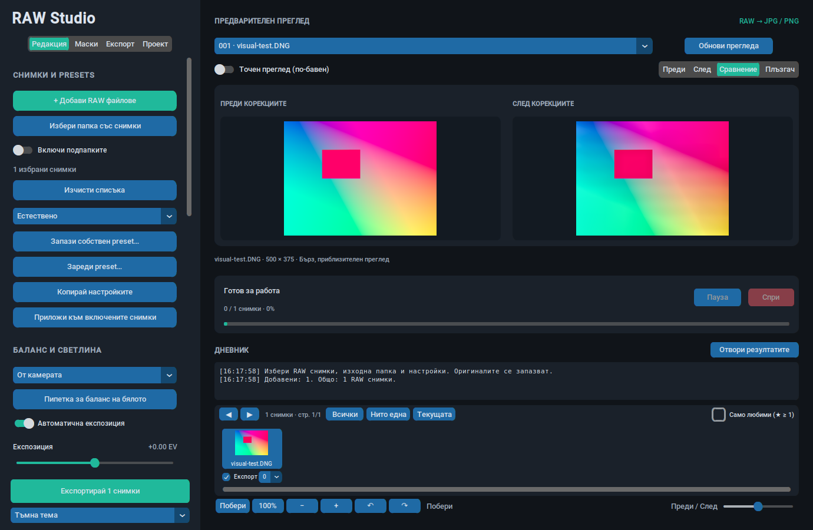

# RAW Studio 2 — Python RAW Processor

Настолно приложение на български за обработка на RAW снимки и експорт в JPG
или PNG. Снимките и редакциите остават локално. Оригиналите не се променят.



В `docs/` има снимки на действителния интерфейс в тъмна и светла тема.
Тестовият цветен кадър е синтетичен DNG, а не снимка от конкретен фотоапарат.

## Windows — стартиране и обновяване

Използвай **64-битов Python 3.12**. Стартирай `start_windows.bat` с двойно
щракване. Той създава `.venv` и инсталира зависимостите; следващите пускания
използват същата среда. Версия 2 има нов маркер за зависимости и автоматично
инсталира добавения ExifRead при първото стартиране след обновяване.

За Git копие на проекта затвори приложението и изпълни в папката му:

```powershell
git pull --ff-only
.\start_windows.bat
```

Ръчно стартиране:

```powershell
py -3.12 -m venv .venv
.venv\Scripts\python.exe -m pip install -r requirements.txt
.venv\Scripts\python.exe raw_processor.py
```

Не е необходимо да променяш PowerShell Execution Policy.

## Linux и macOS

Нужни са Python 3.11+ (проверява се 3.12), Tkinter и графична сесия.
За Debian/Ubuntu, ако липсват Tk и виртуалните среди:

```bash
sudo apt install python3-tk python3-venv
sh start_unix.sh
```

За macOS може да използваш Python от python.org с включения Tkinter.
Алтернативно инсталирай `requirements.txt` в среда и стартирай `raw_processor.py`.

## Работа със снимки

1. В **Редакция** добави файлове или папка. Подпапките се включват с отделен
   превключвател. Повторно добавени файлове се премахват от списъка.
2. Избирай кадър от галерията или менюто над прегледа. Стрелките на клавиатурата
   преминават между снимките, когато фокусът не е в текстово поле.
3. Всеки кадър пази **собствени редакции**. Смяната на снимка запомня текущите
   корекции; останалите снимки запазват своите настройки.
4. Отметката **Експорт** включва/изключва кадъра за серията. Бутоните „Всички“,
   „Нито една“ и „Текущата“ улесняват избора. Оценките са от 0 до 5; филтърът
   за любими показва кадрите с оценка поне 1. Филтърът променя галерията,
   а отметките определят кои кадри действително ще се експортират.
5. Галерията показва до 40 кадъра на страница. Миниатюрите се зареждат във фонова
   нишка; кешът е ограничен до 200 изображения. Повреден RAW остава в списъка
   и грешката му се отчита при преглед/експорт.

Новодобавените снимки получават текущите настройки за светлина, цвят, детайл и
експорт. Изрязванията и локалните маски остават индивидуални.

## Светлина, цвят, presets и история

| Инструмент | Поведение |
| --- | --- |
| Баланс на бялото | От камерата, автоматичен LibRaw, Gray World или Shades of Gray. При невалиден баланс от камерата се използва автоматичен. |
| Пипетка | Щракни върху неутрално сива област в „Преди“. Изчислява допълнителни RGB коефициенти; отхвърля прекалено тъмни или изгорели области. |
| Температура / оттенък | Допълнителна относителна корекция на каналите; плъзгачът не е абсолютна цветна температура в келвини. |
| Автоматична експозиция | Консервативна корекция по 98-ия персентил на линейната яркост, ограничена до ±2 EV. |
| Ръчна експозиция | Допълнителни −3 до +3 EV. |
| Сенки / светли участъци | Отделни плавни корекции според яркостта. |
| Бели / черни тонове | Коригират съответните краища на тоналния диапазон. |
| Наситеност / живост | Общ контрол на цвета и допълнителна сила за по-слабо наситените области. |
| Черно-бяло | Преобразуване по яркост с равни RGB канали. |
| CLAHE | Локален контраст върху 16-битов L канал в Lab с контрол на силата и clip limit. |
| Шум / изостряне | Опционален цветен NLM филтър и изостряне на яркостта. Изострянето при експорт е след промяната на размера. |

Готовите presets са **Естествено**, **Портрет**, **Пейзаж** и **Черно-бяло**.
Можеш да запазваш и зареждаш собствени JSON presets. Те включват светлина,
цвят, детайл и настройки за обектив; запазват индивидуалните изрязвания и маски.

**Копирай настройките → Приложи към включените снимки** копира същите корекции
към избраната серия. Геометрията и локалните маски не се прехвърлят между кадрите.

**Ctrl+Z / Ctrl+Y** или бутоните ↶ / ↷ отменят и повтарят редакциите. Всеки кадър
пази до 100 състояния. Новата редакция след Undo премахва старата redo последователност.

## Преглед, сравнение и хистограма

- „Преди“ е визуализиран RAW със същия базов баланс на бялото и геометрия;
  не е масивът от необработени сензорни данни.
- Режимите са **Преди**, **След**, две снимки за **Сравнение** и **Плъзгач**.
  При „Плъзгач“ долният плъзгач мести границата върху един и същ кадър.
- „Побери“ показва целия кадър. Колелцето, +/− и „100%“ променят увеличението.
  В режим „Местене“ влачи с ляв бутон. 100% автоматично заявява точен преглед
  с пълните пиксели; отчита мащабирането на дисплея.
- Бързият преглед използва half-size декодиране и умаляване. Точният преглед
  изисква повече RAM, защото пази изображението с пълна резолюция за увеличение.
- Хистограмата показва RGB каналите и яркостта. Превключвателят за загубени
  тонове оцветява пиксели с канал 255 в червено и канал 0 в синьо.
  При едновременно изпълнение на двете условия червеното е с предимство.
- Експортът декодира оригинала отново, независимо от размера/увеличението на прегледа.

## Изрязване и локални маски

В раздел **Маски** избери инструмент, който се прилага върху прегледа:

- **Изрязване:** влачи правоъгълник. Поддържа свободно съотношение, 1:1, 4:5,
  3:2 и 16:9. Следващо изрязване се прилага вътре в текущия кадър.
  „Възстанови целия кадър“ премахва изрязването.
- **Геометрия:** завъртане на 90°, хоризонтално/вертикално отражение и
  изправяне на хоризонта до ±15°. Празните краища при изправяне се запълват
  с отражение на съседните пиксели; изрежи ги, ако не са желани.
- **Четка:** настрой радиус, локална експозиция, сенки и наситеност, след което
  рисувай с ляв бутон. Един завършен щрих създава една мека маска.
- **Градиент:** влачи от зона с 0% корекция към зона с 100% корекция.
  Между тях корекцията нараства плавно.
- Маските могат да се премахват по една или всички; Undo възстановява премахнатите.

Координатите са нормализирани, така че еднаква маска се прилага и в бързия
преглед, и при пълния експорт. Маските се изчисляват **след геометрията**.
Препоръчително е първо да изрежеш/завъртиш кадъра: последваща промяна на
геометрията премества областта, към която се отнасят нормализираните маски.

## Корекции на обектива

Има ръчни корекции за радиално изкривяване (k1/k2), винетиране и мащабиране
на червения/синия канал за цветни кантове. Нулевите коефициенти са неутрални.
Това са общи математически корекции, а не фабрична калибрация на обектива.

Настрой ги на собствен кадър и запази JSON профил. По подразбиране папката е
`~/.raw-studio/lenses`. „Автоматичен собствен профил“ избира съвпадение по
EXIF модела на камерата и обектива. Ако няма съвпадение, използва ръчните
настройки и показва статус. Можеш да зареждаш профил и ръчно от друга папка.

**Готова база с фабрични профили не е включена.** Собствен профил е подходящ
за калибрираните условия; при zoom обектив ефектът може да се различава при
друго фокусно разстояние. При преместване на проект на друг компютър копирай
и автоматичните профили или зареди желания профил ръчно.

## Експорт и EXIF

Форматът, размерът, именуването и EXIF опциите от раздел **Експорт** се прилагат
общо към серията; светлината, цветът, геометрията и маските са индивидуални.

| Настройка | Поведение |
| --- | --- |
| JPG | 8 бита; качество 1–100 с компресия със загуба. |
| PNG | 8 или 16 бита на канал; компресия 0–9 променя размера и времето, не качеството. |
| Дълга страна | 0 запазва обработената резолюция. Въведи точен размер, например 2048; съотношението се запазва, без увеличаване на малки изображения. |
| Шаблон за име | `{stem}`, `{index:04d}`, `{date}`, `{camera}`. Например `event_{index:04d}_{stem}`. Датата е от EXIF, с резервен вариант файловата дата. |
| EXIF | Отделен избор за камера/обектив, дата и настройки на заснемането. GPS, серийни номера, MakerNotes и RAW ICC профили не се копират. |

Изходните изображения са sRGB. Ориентацията в EXIF е 1, защото RAW ориентацията
и редакциите вече са приложени към пикселите. PNG16 запазва 16-битовите канали
и при включен EXIF; метаданните се добавят без повторно кодиране на пикселите.
RAW форматите с непознати/липсващи EXIF данни могат да се обработят без тях.

По подразбиране съществуващи резултати не се презаписват; добавят се суфикси
`_001`, `_002` и т.н. Резултатът се записва във временен файл и се публикува
атомарно след успешно кодиране. RAW оригиналите не се използват като изход.
Повреден файл се отчита в дневника, а серията продължава със следващия.

## Пауза, спиране и продължаване

„Пауза“ спира на безопасна граница между операциите; „Продължи“ освобождава
обработката. Изпълняваща се LibRaw/OpenCV операция трябва да приключи първо.
„Спри“ прекратява серията на безопасна граница. Затварянето използва същото поведение.

В изходната папка се пази **`raw-studio-batch.json`** с файловете, фиксираните
настройки, изходните имена и успешните резултати. От **Експорт → Продължи
запазена серия…** отвори този дневник. Готовите, непроменени резултати се
пропускат; останалите се обработват със запазените индивидуални настройки.
Променени входове/настройки започват нова серия. Нов старт в същата папка
замества дневника на предишната серия, но запазва изображенията.

## Проекти

От **Проект** запази файл `.rawstudio` или използвай Ctrl+S. Проектът пази
пътищата до оригиналите, индивидуалните корекции, маските, оценките, отметките,
историята Undo/Redo, избрания кадър и изходната папка. Отвори го при следващо
стартиране, за да възстановиш работата. RAW файловете не се вграждат в проекта.
Липсващите оригинали се показват в дневника. Запазването е атомарно.

## Автоматична обработка на папка

1. Избери изходната папка, настройки и формат.
2. В **Проект** избери папка за автоматичен експорт.
3. Съществуващите файлове образуват начален списък и не се експортират автоматично.
4. Нови/променени RAW файлове се добавят след две непроменени интервални проверки
   (проверка през 2 секунди), за да не се обработва файл по време на копиране.
5. Когато приложението е свободно, те се експортират във фоновата нишка.
6. „Спри наблюдението“ прекратява следенето и премахва чакащите нови файлове;
   вече започнал експорт се спира с „Спри“.

Наблюдението работи, докато приложението е отворено. Повреден или все още
недовършен файл се отчита като грешка; нова промяна на файла го подава отново.

## Качество и ограничения

Декодирането е 16-битово линейно RGB; корекциите използват float32. CLAHE
работи с 16-битов L канал. Цветният OpenCV NLM изисква 8-битов вход; разликата
от шумопотискането се добавя обратно към изображението с висока точност.
Това запазва суб-8-битовия сигнал, но не е изцяло 16-битов NLM алгоритъм.

Сенките и светлините преразпределят наличните тонове; напълно изгорял сензорен
детайл не може да се възстанови с плъзгач. Прегледът при half-size е приблизителен.
Големи RAW файлове и точен преглед изискват повече RAM; NLM може да е бавен.
Поддръжката на конкретен фотоапарат и RAW компресия зависи от включения LibRaw.

## Архитектура и самостоятелен скрипт

| Файл | Роля |
| --- | --- |
| `raw_processor.py` | Стартиране и тъмна тема. |
| `raw_engine.py` | Декодиране, параметри, високоточна обработка, преглед и атомарен експорт. |
| `imaging.py` | Тонове, цвят, нормализирани маски, геометрия, обектив и хистограма. |
| `metadata.py` | Избрани EXIF данни и вграждане без загуба на PNG16 точност. |
| `studio.py` | Състояние на снимките, история, проекти, presets и профили за обектив. |
| `batch.py` | Откриване, именуване, пауза, дневник/продължаване и наблюдение на папки. |
| `app_gui.py` | CustomTkinter интерфейс и предаване на резултати към главната Tk нишка. |
| `RAW_Studio.py` | Генерирана самостоятелна версия със същите функции. |

Работниците изпращат събития към Queue. Главната нишка ги прочита с `after()`;
фоновите нишки не четат Tk променливи и не обновяват widgets. Експортът е
последователен за ограничаване на RAM. Миниатюрите и наблюдението имат отделни
работници и ограничени кешове/опашки за интерфейса.

За самостоятелната версия инсталирай `requirements.txt` и изпълни
`python RAW_Studio.py`. Тя не изисква другите Python файлове. След редакция на
модулите генерирай отново с `python tools/build_standalone.py`.

## Проверки

```bash
python -m pip install -r requirements-dev.txt
python -m pytest -q tests/test_engine.py tests/test_batch.py tests/test_studio.py
python tools/build_standalone.py --check
```

GUI проверки на Windows:

```powershell
python tools/check_gui.py
```

На Linux с виртуален дисплей:

```bash
xvfb-run -a python tools/check_gui.py
```

Всеки GUI тест използва отделен Python/Tk процес. GitHub Actions проверява
двигателя на Windows, Linux и macOS и действителния GUI на Windows и Linux.
Тестовете генерират Bayer DNG и използват истински LibRaw. Проверява се и
съответствието между модулната и самостоятелната версия. Конкретни RAW файлове
от твоя фотоапарат не са предоставени; провери резултата и с реални кадри.

## Документация на библиотеките

- [rawpy Params](https://letmaik.github.io/rawpy/api/rawpy.Params.html)
- [OpenCV CLAHE](https://docs.opencv.org/4.x/d6/db6/classcv_1_1CLAHE.html)
- [CustomTkinter](https://customtkinter.tomschimansky.com/documentation/)
- [Pillow EXIF](https://pillow.readthedocs.io/en/stable/reference/Image.html#PIL.Image.Exif)
- [ExifRead](https://github.com/ianare/exif-py)
